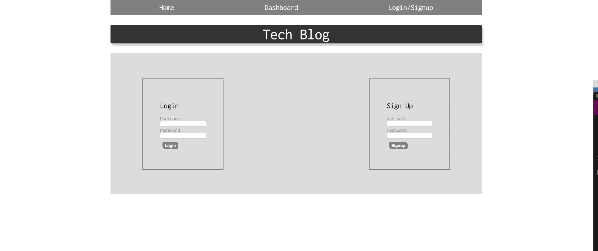
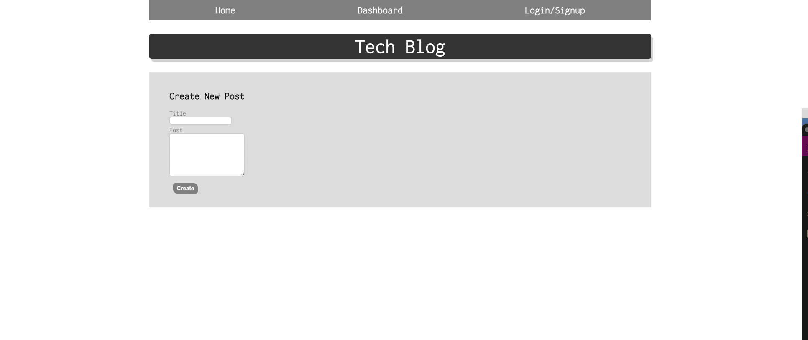
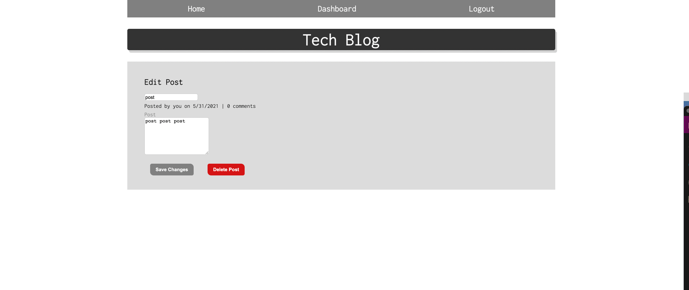
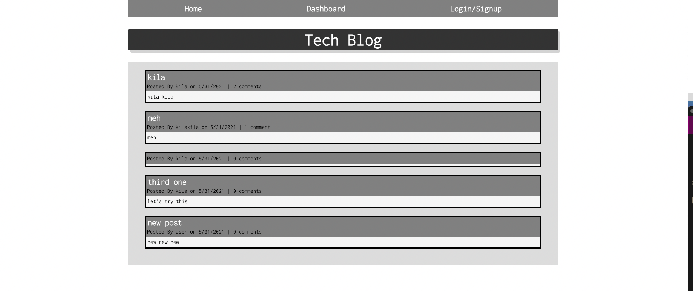

# MVC-Tech-Blog

## Description
This application uses the Model-View-Controller paradign to create a blog website where users can create a login, make and edit posts, view and comment on others' posts. 

- [Deployed Website](https://kilaweeks.github.io/MVC-Tech-Blog/)
- [Link to Heroku](https://whispering-plateau-10963.herokuapp.com/)

## Images

## Technologies
- JavaScript
- Node.js
- MySQL
- Express.js
- Sequelize
- dotenv
- bcrypt
- handlebars
- Heroku 

## Questions

If you have any questions, please contact me at https://github.com/kilaweeks or kilaweeks@gmail.com.